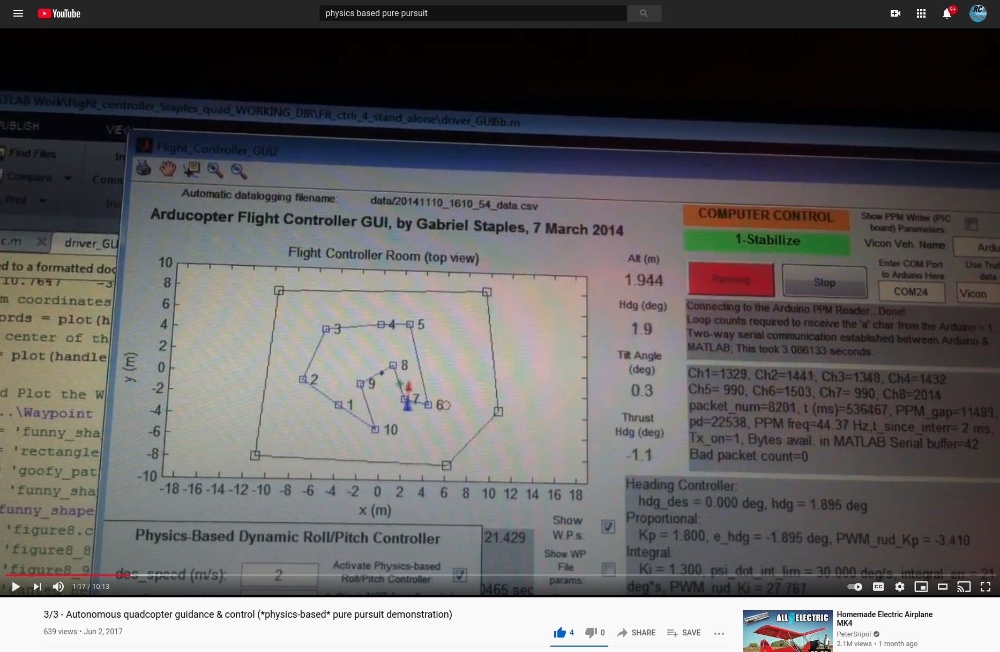

# Hi, I'm Gabriel Staples 👋

[Sponsor Me on GitHub](https://github.com/sponsors/ElectricRCAircraftGuy)

I'm an Idaho country guy from a small town near Boise. Where I come from, town sizes are measured in the quantity of stop lights we have. Some towns are so small they have zero. My town was a 3 stop light town. Today, it has more. Before that we were in just a 1-blinking-light town. I grew up jumping off cliffs, bridges, and railroad trestles and doing flips off of rope swings into rivers, canals, and reservoirs. For work, I shoveled poo and cleaned cow stalls, dug ditches with a pick, chopped wood, bucked hay, fed cows, irrigated fields with siphon tubes, weeded gardens, and mowed grass.

<b>(click to expand and learn more)</b>

Now, I live in the San Francisco Bay area and work in San Francisco. I'm trying to balance my life somehow as a husband, father, active Christian, and multi-faceted engineer. When I'm not busy trying to figure out how to better learn my job as a [senior embedded software engineer][linkedin], I'm trying to spend time with my two kids and wife, figure out how to make a Jekyll-based [website so I can write about my thoughts](https://gabrielstaples.com), and spend some time [flying my radio-controlled airplanes][3dhawk] or building or creating something.

I also programmed this gadget and [sell it on Amazon](https://www.amazon.com/Computa-Pranksta-Keyboard-Device-50-Settings/dp/B06ZYZ2GTB/ref=as_li_ss_tl?ie=UTF8&linkCode=ll1&tag=wwwel-20&linkId=d0d2f1c2c4c1ad77d6de98d905f00ce7&language=en_US), and trying to do the business side of things and [handle customer support](https://github.com/ElectricRCAircraftGuy/eRCaGuy_ComputaPranksta_Support) takes a lot of my spare time.

I am big into RC aircraft and embedded programming. Very fun stuff. I _love_ airplanes and all things that fly! I _love_ building control systems to make autonomous vehicles autonomous. I'm an aeronautical engineer by trade, but I also do a lot with electronics, electrical engineering, and computer science/programming (including a lot with C/C++ in Arduino and some lower-level AVR code). That's how I got my job I have today. Here's my website, with some articles on the aforementioned topics, showing a tiny subset of my work: http://www.ElectricRCAircraftGuy.com. More recently, I created https://gabrielstaples.com to have an avenue to write about anything.

I strive to be a [polyglot](https://www.wordreference.com/definition/polyglot). I have studied both _foreign languages_ and _programming languages_ many thousands of hours.

> I speak English. (Hablo inglés.) (Je parle anglais.) (أنا أتكام الإنجليزية.)  
> Hablo español. (I speak Spanish.) (Je parle espagnol.) (أنا أتكلم الاِسبانية.)  
> Je parle un peu de français. (I speak some French.) (Hablo algo de francés.) (أنا أتكلم بعض الفرنسية.)  
> Eu falo muito pouco de português. (I speak very little Portuguese.)  
> انا اتكلم العربية قليلاً جداً. (I speak Arabic very little.) (Hablo muy poco de árabe.) (Je parle un petit peu l'arabe.)  

I love learning about foreign people, eating foreign foods, and speaking foreign languages. I have put many thousands of hours into foreign language study--just as I have done for aeronautical engineering, electrical engineering, programming, electronics, and controls. I speak Spanish really well and have even helped translate official medical training documents. French is my next best, and is my current area of study. Next comes Portuguese, which I have the least formal training in, but speak next best because it's like a blend of Spanish and French. Lastly, comes Arabic. Although I technically have a minor in it, I'm not conversational in the slightest. Nevertheless, I can read and write it, and I know the alphabet. I have put a great deal of effort into proper pronunciation so I can read and write and make all the sounds. 

## Here's one of my favorite projects I've ever done! (Autonomous quadcopter flight controller I wrote myself)

_Quadcopter Physics-based Flight controller demo w/lead point navigation & Arduino interface to RC Tx_. 

See some of the code from an Arduino to the back of an RC Tx (required to duplicate this project yourself) here: https://github.com/ElectricRCAircraftGuy/eRCaGuy_PPM_Writer.

    
    

**Flight Controller Videos:**

1. [1/3 - Autonomous quadcopter guidance and control (*physics-based* pure pursuit simulation)][quadcopter1]
1. [2/3 - Autonomous quadcopter guidance and control (*PID-based* pure pursuit demonstration)][quadcopter2]
1. [3/3 - Autonomous quadcopter guidance & control (*physics-based* pure pursuit demonstration)][quadcopter3] <=== my favorite video

## You can find me at many places online:

<b>(click to expand)</b>

1. **My Websites** (listed newest first): 
    1. [**GabrielStaples.com**](https://GabrielStaples.com) - my newest and current, anything-I-want Jekyll-based website. Topics I write about here include engineering and programming of course, but I want this to literally be a place I can write about _anything_, so it will also cover some of my thoughts and knowledge on finances and life skills, such as general computer skills, refinancing a house, calculating loan costs, and fixing my bike or phone. It is also where I can write about politics and religion. This is a website that is truly my own. Being a Jekyll site, this also allows me to write in markdown (same as this readme itself), which makes writing less burdensome. 
    1. [**ElectricRCAircraftGuy.com**](http://www.ElectricRCAircraftGuy.com) - my slightly-older, general-purpose engineering and programming website. 
 
Examples of some of my more-popular articles (click to expand):

        1. [Restoring/Recharging Over-discharged LiPo (Lithium Polymer) Batteries!](https://www.electricrcaircraftguy.com/2014/10/restoring-over-discharged-LiPos.html)
        1. [Parallel Charging Your LiPo Batteries](https://www.electricrcaircraftguy.com/2013/01/parallel-charging-your-lipo-batteries_22.html)
        1. [The Power of Arduino](https://www.electricrcaircraftguy.com/2014/01/the-power-of-arduino.html)
        1. [Propeller Static & Dynamic Thrust Calculation - Part 1 of 2](https://www.electricrcaircraftguy.com/2013/09/propeller-static-dynamic-thrust-equation.html)
        1. [Arduino Power, Current, and Voltage Limitations](https://www.electricrcaircraftguy.com/2014/02/arduino-power-current-and-voltage.html)
        1. [Using the Arduino Uno’s built-in 10-bit to 16+-bit ADC (Analog to Digital Converter)](https://www.electricrcaircraftguy.com/2014/05/using-arduino-unos-built-in-16-bit-adc.html)
        1. [Arduino micros() function with 0.5us precision - using my Timer2_Counter Library](https://www.electricrcaircraftguy.com/2014/02/Timer2Counter-more-precise-Arduino-micros-function.html)
    1. [**OldSite.ElectricRCAircraftGuy.com**](http://oldsite.electricrcaircraftguy.com/) - my oldest website, with various useful articles which are still found here and only here. See the navigation links in the top-left corner for more articles. Examples:
        - [Page 6: Helicopter Control Explanation (Gyroscopic Precession)](http://oldsite.electricrcaircraftguy.com/page-6-helicopter-control-explanation-gyroscopic-precession)
1. **Forums & Community Sites (these are just a few)**:
    1. [**Wikipedia.org--@ERCaGuy**](https://en.wikipedia.org/wiki/User:ERCaGuy) - see [my contributions to Wikipedia here](https://en.wikipedia.org/w/index.php?title=Special:Contributions/ERCaGuy&offset=&limit=500&target=ERCaGuy).
    1. [**cppreference.com--@ERCaGuy**](https://en.cppreference.com/w/User:ERCaGuy) - see [my contributions to the cppreference.com C and C++ reference documentation here](https://en.cppreference.com/w/Special:Contributions/ERCaGuy).
    1. [**Gumroad.com--@gabrielstaples**](https://gumroad.com/gabrielstaples) - download some things I've made here. Note: Gumroad is intended to be a place you can BUY (pay $$ for) things. So, I have some downloads for sale here, though most are _no cost_ ($0.00) but allow an _optional_ payment or "donation" to support my work if you so choose. 
    1. [**Instructables.com--@ElectricRCAircraftGuy**](https://www.instructables.com/member/ElectricRCAircraftGuy/instructables/) - see my Instructables articles here.
    1. [**FliteTest.com--@panther3001**](https://www.flitetest.com/authors/panther3001) - see my FliteTest articles here.
    1. [**RCGroups.com--@panther3001**](https://www.rcgroups.com/forums/member.php?u=337946)
    1. [**Forum.arduino.cc--@panther3001**](https://forum.arduino.cc/index.php?action=profile;u=176611)
1. [**LinkedIn**][linkedin] - follow me on LinkedIn!
    - Please DO _follow me_ on LinkedIn! Please don't try to _add_ me as a connection unless I can vouch for your skills.
1. [**All of my "Stack Exchange" Sites (incl. Stack Overflow)**](https://stackexchange.com/users/3032157/gabriel-staples?tab=accounts) 
 
(click to expand)

    1. Stack Overflow
    1. Ask Ubuntu
    1. Arduino
    1. Super User
    1. Electrical Engineering
    1. Unit & Linux
    1. etc.
1. [**GitHub**](https://github.com/ElectricRCAircraftGuy)
1. [**YouTube--@eRCaGuy** (ElectricRCAircraftGuy) Channel](https://www.youtube.com/ElectricRCAircraftGuy). Examples:
    - [Hovering HobbyKing/Nitroplanes 3D Hawk for 4.5 min. Straight, at night!][3dhawk]
1. [**Instagram--@ercaguy**](https://www.instagram.com/ercaguy/)
1. **Twitter**: 
    1. [**Twitter (Hobby)--@eRCaGuy**](https://twitter.com/eRCaGuy)
    1. [**Twitter (Personal)--@GabrielStaples3**](https://twitter.com/GabrielStaples3)

  [quadcopter1]: https://www.youtube.com/watch?v=LjuPA43HceQ
  [quadcopter2]: https://www.youtube.com/watch?v=wY3oh2GIfCI
  [quadcopter3]: https://www.youtube.com/watch?v=H5kXzpPFdII&t=35s
  [linkedin]: https://www.linkedin.com/in/gabriel-staples/
  [3dhawk]: https://www.youtube.com/watch?v=nyqrlkpBXmY&t=3s

<!--
**ElectricRCAircraftGuy/ElectricRCAircraftGuy** is a ✨ _special_ ✨ repository because its `README.md` (this file) appears on your GitHub profile.

Here are some ideas to get you started:

- 🔭 I’m currently working on ...
- 🌱 I’m currently learning ...
- 👯 I’m looking to collaborate on ...
- 🤔 I’m looking for help with ...
- 💬 Ask me about ...
- 📫 How to reach me: ...
- 😄 Pronouns: ...
- ⚡ Fun fact: ...
-->
